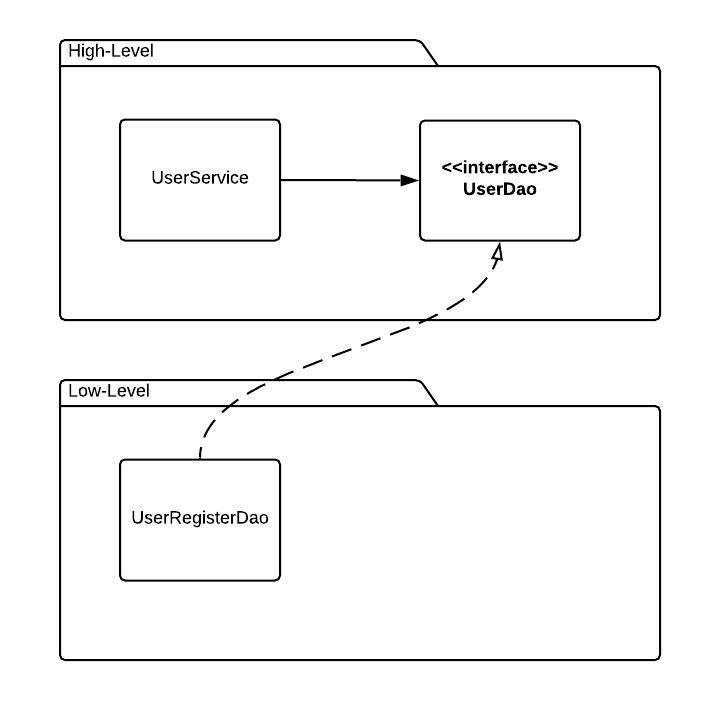

# SOLID Principles


* Introduced by Robert C. Martin (Uncle Bob) in his paper called [Design Principles and Design Patterns](https://web.archive.org/web/20150906155800/http://www.objectmentor.com/resources/articles/Principles_and_Patterns.pdf) (2000);
* The term SOLID was coined by Michael Feathers;
* The goal of this principles is to make software more understandable, improving the software maintainability and extensions; 

## Single responsibility principle

Every module, class or function should have only one reason to exist. The goal of this principle is to reduce the complexity of classes, methods or modules in the software. In the below example, it is possible to analyze a slightly complex method, dealing with four possible outputs from different business rules.

```java
Shipment shipment = Shipment.of(LocalDateTime.now().plusDays(-1), 10l, 100d);

if (shipment.getWeight() < 10L || shipment.getWeight() > 1000L){ 
    System.out.println("This shipment has an invalid weight");
} else if (!shipment.getQuantity().equals(0)) {
    System.out.println("This shipment must have at least one item.");
} else if (shipment.getRequest().isAfter(LocalDateTime.now())) {
    System.out.println("This shipment is late.");
} else {
    System.out.println("This shipment is valid.");
}
```

The idea of this principle is to separate these rules in different classes, this way each class will be responsible to check their conditions. In the future, other developers will be able to read and understand this method quickly because it was done simply. There is below an example of a specialized class to check only one business rule.

```java
public class ShipmentValidationWeight {

    private static final Long MINIMUM_WEIGHT = 10L;
    private static final Long MAX_WEIGHT = 1000L;

    public static String validation(Shipment shipment) {
        if (shipment.getWeight() < MINIMUM_WEIGHT || shipment.getWeight() > MAX_WEIGHT){
            return "The shipment has an invalid weight";
        }
        return "The shipment has a valid weight";
    }
}
```

## Open/closed principle

The definitinion of this principle says "Classes, modules, functions should be open for extensions, but closed for modification". The idea of ​​this principle is to separate different conditions that follow a common principle into different classes, using the first SOLID principle. In the example below, the calculate method encompasses all discount conditions, making it a low cohesion method. 

```java
public class DiscountProduct {

    private static final double ELECTRONIC_PRICE_MINIMUM_DISCOUNT = 5000;
    private static final double ELECTRONIC_PRICE_MIN_DISCOUNT = 0.9;
    private static final double ELECTRONIC_PRICE_MAX_DISCOUNT = 0.75;
    private static final double SPORT_PRICE_WITH_DISCOUNT = 0.75;

    public double calculate(double price, ProductType productType){
        double priceWithDiscount = price;
        if (productType.equals(ProductType.ELECTRONIC)) {
            if (price > ELECTRONIC_PRICE_MINIMUM_DISCOUNT) {
                priceWithDiscount = price * ELECTRONIC_PRICE_MAX_DISCOUNT;
            } else {
                priceWithDiscount = price * ELECTRONIC_PRICE_MIN_DISCOUNT;
            }
        } else if (productType.equals(ProductType.SPORT)) {
            priceWithDiscount = price * SPORT_PRICE_WITH_DISCOUNT;
        }
        return priceWithDiscount;
    }

}
```

To improve this code using the Open/Closed principle, it will be necessary to use the object-oriented programming polymorphism to create an abstract class or interface that will determine the common method for each concrete class. In the below example, it was created an interface with a method called calculate and the classes that represent the kind of product will implement this interface and determine the calculus behavior. 

```java
public interface Discount {
    double calculate(double price);
}

public class ElectronicProductsDiscount implements Discount {

    private static final double PRICE_MINIMUM_DISCOUNT = 5000;
    private static final double PRICE_MIN_DISCOUNT = 0.9;
    private static final double PRICE_MAX_DISCOUNT = 0.75;

    @Override
    public double calculate(double price) {
        if (price > PRICE_MINIMUM_DISCOUNT){
            return price * PRICE_MAX_DISCOUNT;
        }
        return price * PRICE_MIN_DISCOUNT;
    }
}

public class SportProductsDiscount implements Discount {

    private static final double PRICE_WITH_DISCOUNT = 0.75;

    @Override
    public double calculate(double price) {
        return price * PRICE_WITH_DISCOUNT;
    }
}

public class ApplyingOCP{
    public static void run(){
        Discount discountSport = new SportProductsDiscount();
        discountSport.calculate(120d);

        Discount discountEletronic = new ElectronicProductsDiscount();
        discountEletronic.calculate(1200d);
    }
}
```

## Liskov substitution principle

This principle is closely linked to the Open/Closed principle. The principle informs that the object can be replaced with an instance of its subtype without changing system behavior. In the example below, when the MechanicalDuck subtype is instantiated, it must also insert a battery for its operation, which Duck does not expect for its operation.

```java
public class Duck {

    public String walk(){
        return "Walking... ";
    }
}

public class Battery {

    private float charge;

    public Battery(){
        charge = 100;
    }

    public float getCharge() {
        return charge;
    }

    public boolean isCharge(){
        return getCharge() > 0;
    }
}

public class MechanicalDuck extends Duck {

    private Optional<Battery> battery;

    public MechanicalDuck(Optional<Battery> battery){
        this.battery = battery;
    }

    @Override
    public String walk(){
        if (!battery.isPresent() || !battery.get().isCharge()){
            return "Error! It is not walking because of needing a battery... ";
        }
        return "Walking... ";
    }

}

public class ApplyingLSP {

    public static void run() {
        System.out.println("Applying Liskov Substitution Principle");
        Duck duck = new Duck();
        System.out.println(duck.walk());

        Battery battery = new Battery();
        MechanicalDuck mechanicalDuckExample1 = new MechanicalDuck(Optional.of(battery));
        System.out.println(mechanicalDuckExample1.walk());

        MechanicalDuck mechanicalDuckExample2 = new MechanicalDuck(Optional.empty());
        System.out.println(mechanicalDuckExample2.walk());

    }
}
```

## Interface segregation principle

No class/client should be forced to depend on methods it does not use. In the below example is possible to see an interface called Developer that has 3 methods. In the software development context, a junior developer is learning how to code or improving their capacity to code and not how to project an enterprise business solution. However, the Developer interface will require the JuniorDeveloper class to implement all these methods (develops, architectApplication, reviewCode). To avoid an implementation, maybe the developers will throw an exception as a solution to this case..

```java
public interface Developer {
    void develops();
    void architectApplication();
    void reviewCode();
}

public class JuniorDeveloper implements Developer {

    @Override
    public void develops() {
        // TODO something
    }

    @Override
    public void architectApplication() {
        throw new RuntimeException("A junior developer cannot develop an architecture of a large application.");
    }

    @Override
    public void reviewCode() {
        throw new RuntimeException("A junior developer is learning how to develop.");
    }
}
```

In the below example, the Interface Segregation Principle is being applied. The JuniorJavaDeveloper class will only implement the develops method from the JuniorDeveloper interface and the SeniorJavaDeveloper will implements all methods from the SeniorDeveloper interface (in the real context, the senior developer has more skills than a junior developer).

```java
public interface JuniorDeveloper {
    void develops();
}

public interface SeniorDeveloper extends JuniorDeveloper {
    void architectApplication();
    void reviewCode();
}

public class JuniorJavaDeveloper implements JuniorDeveloper {
    @Override
    public void develops() {
        // TODO something
    }
}

public class SeniorJavaDeveloper implements SeniorDeveloper {
    @Override
    public void architectApplication() {
        // TODO something
    }

    @Override
    public void reviewCode() {
        // TODO something
    }

    @Override
    public void develops() {
        // TODO something
    }
}
```

## Dependency inversion principle

* High-level modules should not depend on low-level modules. Both should depend on abstractions.
* Abstractions should not depend on details. Details should depend on abstractions.

In the example below, it is possible to see to differents modules where the High-Level module only will communicate with Low-Level through the UserDao interface (abstraction used to communication). 



### Examples
All examples can be found in this repository into the [java folder](https://github.com/Murillo/SOLID-Principles/tree/Description-Update-Readme/java/src/com/solid).

### Presentation
[Link on SlideShare](https://www.slideshare.net/msgrubler/solid-principles-178660790)
